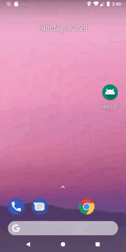

# Send Data To ParentActivity Using RequestCode & Return Result with Up Button in ActionBar.



## Introduction

The purpose of this app is to show how to send data back to the parent activity using request code and how to modify the up button in an action bar by overriding the method called onOptionsItemSelected.

## Send Data back to Parent Activity

We can also return results in the reverse direction, from secondary or child activity to a parent activity by setting up something called request code.

#### Main Activity :  
Call a method called startActivityForResult. This method takes a different set of arguments. We need an intent and a requestCode.

```
Intent intent = new Intent(MainActivity.this,Activity_2.class);
startActivityForResult(intent,NAME_REQUEST_CODE);
```

Now in 
#### Activity_2 : 

```
@Override
    public void onBackPressed() {
        String firstName = firstName_et.getText().toString();
        String lastName = lastName_et.getText().toString();
        Intent intent = new Intent();
        intent.putExtra(MainActivity.FIRST_NAME,firstName);
        intent.putExtra(MainActivity.LAST_NAME,lastName);
        setResult(RESULT_OK,intent);
        finish();
    }
```

Now we have to handle the result in 
#### MainActivity :

```
    @Override
    protected void onActivityResult(int requestCode, int resultCode,Intent data) {
        super.onActivityResult(requestCode, resultCode, data);

        if (requestCode == NAME_REQUEST_CODE && resultCode == RESULT_OK){
            String firstNameText = data.getStringExtra(FIRST_NAME);
            String lastNameText = data.getStringExtra(LAST_NAME);
             firstName.setText(firstNameText);
             lastName.setText(lastNameText);
        }
    }
```

## Handle Result on Up Button Click in ActionBar

To send a data to parent activity using up button in ActionBar on onCreate add this line of code `getSupportActionBar().setHomeAsUpIndicator(R.drawable.ic_done_black_24dp);`

```
@Override
    public boolean onOptionsItemSelected(MenuItem item) {
        if (item.getItemId() == android.R.id.home){
            onBackPressed();
            return true;
        }
        return super.onOptionsItemSelected(item);
    }
```

# Thank You.
